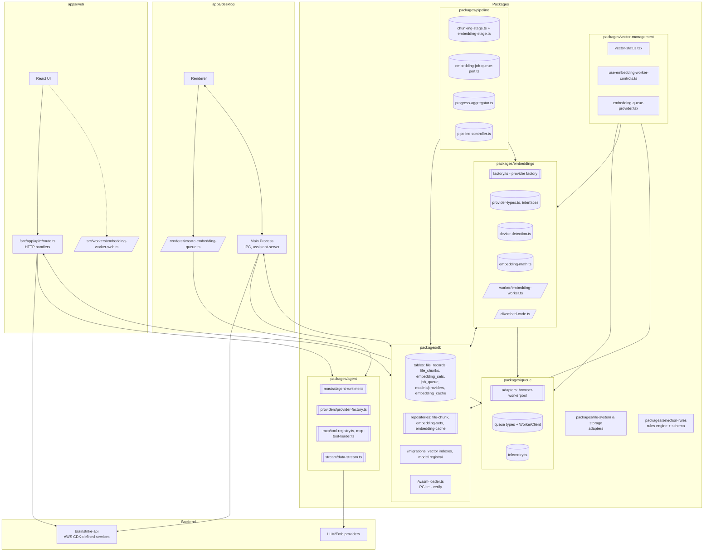

# Container / Module View (C4 Level 2)

```mermaid
flowchart TB
  subgraph Web[apps/web]
    WUI[React UI]
    WAPI["/src/app/api/*/route.ts<br/>HTTP handlers"]
    WWorker[/src/workers/embedding-worker-web.ts/]
  end

  subgraph Desktop[apps/desktop]
    DMain["Main Process<br/>IPC, assistant-server"]
    DRenderer[Renderer]
    DQueue[/renderer/create-embedding-queue.ts/]
  end

  subgraph Packages
    subgraph DB[packages/db]
      DBModels[("tables: file_records, file_chunks, embedding_sets,<br/>job_queue, models/providers, embedding_cache")]
      DBRepos[["repositories: file-chunk, embedding-sets, embedding-cache"]]
      DBMigs["/migrations: vector indexes, model registry/"]
      DBWasm["/wasm-loader.ts<br/>PGlite - verify"]
    end

    subgraph Embeddings[packages/embeddings]
      EMBFactory[["factory.ts - provider factory"]]
      EMBTypes[("provider-types.ts, interfaces")]
      EMBDevice[("device-detection.ts")]
      EMBMath[("embedding-math.ts")]
      EMBWorker[/worker/embedding-worker.ts/]
      EMBCLI[/cli/embed-code.ts/]
    end

    subgraph QueuePkg[packages/queue]
      QAdapters[["adapters: browser-workerpool"]]
      QTypes[("queue types + WorkerClient")]
      QTelemetry[("telemetry.ts")]
    end

    subgraph VectorMgmt[packages/vector-management]
      VStatus[vector-status.tsx]
      VControls[use-embedding-worker-controls.ts]
      VProvider[embedding-queue-provider.tsx]
    end

    FS["packages/file-system & storage<br/>adapters"]

    subgraph Pipeline[packages/pipeline]
      PStages[("chunking-stage.ts + embedding-stage.ts")]
      PQueue[("embedding-job-queue-port.ts")]
      PProgress[("progress-aggregator.ts")]
      PController[("pipeline-controller.ts")]
    end

    SR["packages/selection-rules<br/>rules engine + schema"]

    subgraph Agent[packages/agent]
      ARuntime[[mastra/agent-runtime.ts]]
      AProvider[[providers/provider-factory.ts]]
      AMCP[["mcp/tool-registry.ts, mcp-tool-loader.ts"]]
      AStream[[stream/data-stream.ts]]
    end
  end

  subgraph Backend
    API["brainstrike-api<br/>AWS CDK-defined services"]
    Providers[LLM/Emb providers]
  end

  WUI --> WAPI
  WUI -.-> WWorker
  DRenderer --> DQueue
  DRenderer <--> DMain

  WAPI --> Agent
  DMain --> Agent

  WAPI <--> DB
  DMain <--> DB

  Embeddings <--> DB
  Embeddings --> QueuePkg
  VectorMgmt --> QueuePkg
  DQueue --> QueuePkg
  VectorMgmt --> Embeddings
  VectorMgmt --> DB
  Pipeline --> DB
  Pipeline --> Embeddings

  Agent --> Providers
  WAPI --> API
  DMain --> API
```
