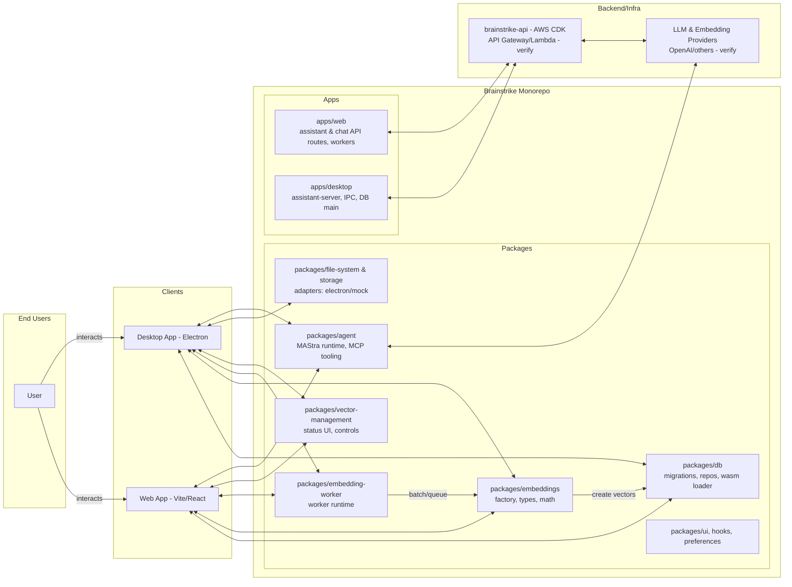

# 1) System Context (C4 Level 1)

```mermaid
flowchart LR
  subgraph UserSpace[End Users]
    U1[User]
  end

  subgraph Clients[Clients]
    W["Web App - Vite/React"]
    D["Desktop App - Electron"]
  end

  subgraph Core[Brainstrike Monorepo]
    subgraph Pkgs[Packages]
      DB["packages/db<br/>migrations, repos, wasm loader"]
      EMB["packages/embeddings<br/>factory, types, math"]
      EW["packages/embedding-worker<br/>worker runtime"]
      VM["packages/vector-management<br/>status UI, controls"]
      FS["packages/file-system & storage<br/>adapters: electron/mock"]
      AG["packages/agent<br/>MAStra runtime, MCP tooling"]
      UI[packages/ui, hooks, preferences]
    end
    subgraph Apps[Apps]
      AWeb["apps/web<br/>assistant & chat API routes, workers"]
      ADesk["apps/desktop<br/>assistant-server, IPC, DB main"]
    end
  end

  subgraph Backend[Backend/Infra]
    API["brainstrike-api - AWS CDK<br/>API Gateway/Lambda - verify"]
    LLM["LLM & Embedding Providers<br/>OpenAI/others - verify"]
  end

  U1 -->|interacts| W
  U1 -->|interacts| D

  W <--> DB
  W <--> EMB
  W <--> EW
  W <--> VM
  W <--> AG

  D <--> DB
  D <--> EMB
  D <--> EW
  D <--> VM
  D <--> FS
  D <--> AG

  AWeb <--> API
  ADesk <--> API
  EMB -->|create vectors| DB
  EW -->|batch/queue| EMB
  AG <--> LLM
  API <--> LLM
```
